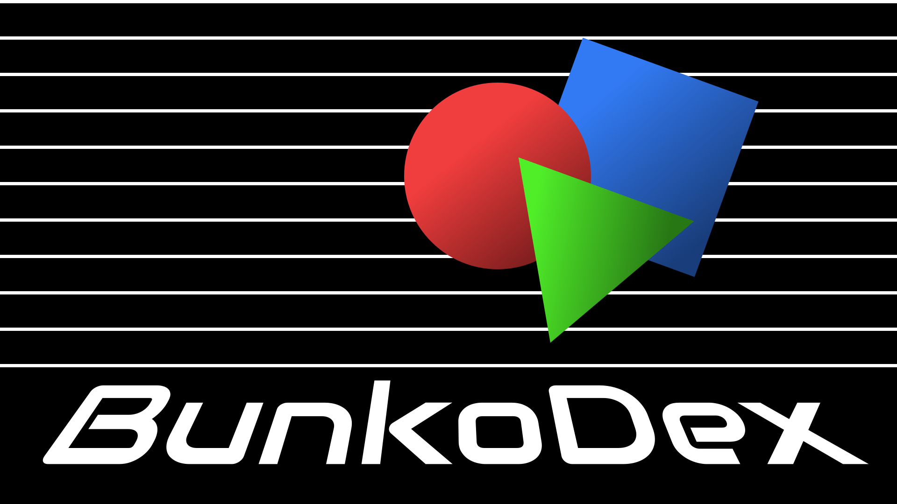

  <h1>BunkoDEX</h1>
  
  
Open Source Catalog System

  

## How it work?

The BunkoDEX catalog system works in a very simple way: 
The numerical code consists of two members consisting of three digits, separated by a dot and a HEX sub-subcategory (always three characters). 
A pre-set table with the wiki of the main categories will be published shortly.

# INSTALL BunkoDEX

Read [INSTALL.md](INSTALL.md) for correct installation of BunkoDEX.

## Little example
An Arch Linux CD. 
Main category: 
IT -> `(COD. 034)` 
Operating Systems in CD -> `(COD. 143)` 
The BunkoDEX code will be `034.143` 
For a more precise classification, an additional BunkoDEX identification code can be added after the sub-category. 
For example: ArchLinux is a Linux distribution. 
It is part of the IT category, therefore the COD. 034 is correct; 
Linux code is `D` -> Arch is `7F` 
So the complete BunkoDEX code for the Arch Linux CD will be: 
`034.143:D7F` 
*PS. All written codes are purely invented, in the official table they will be different. I remember that they can be customized to your liking, provided that the syntax remains the same.*

# License
The AGPL license for BunkoDEX immediately permits you to use, study, modify and disseminate BunkoDEX and any of your modifications for any purpose, even for commercial purposes, provided that any contributions are in turn released with these freedoms, for a collective benefit. You should have received a copy of the [GNU Affero General Public License](https://www.gnu.org/licenses/agpl-3.0.html).

## Why the name BunkoDEX?
Bunko (文庫) mean Paperback.  
DEX for a software. 
BunkoDEX was initially invented to catalog books in a library, then it became a multipurpose cataloging system
